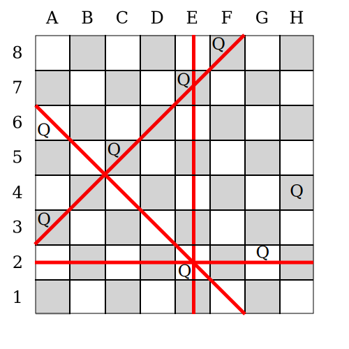

# Constraint System Demonstration Via The N Queen Problem
The \\(N\\) queens puzzle requires \\(N\\) queens to be placed on a
\\(N \\times N\\) chessboard so that there is no row,
column or diagonal with more than one queen.


> Example Of The N Queen Problem

Here the concept of the constraint system is explained by using the N queen
problem as an example.
A step-by-step guide for implementing the N queen problem can be found
[here](n-queen-problem.implementation.md).
## Rating Function
> What is an optimal solution of the N queen problem?

The rating function of the N Queen Problem returns the number of queen pairs,
that are in same row, column or diagonal.
If there are no such pairs, the solution in question is optimal,
because no rules are violated.
The smaller the number of such pairs, the better one can consider a given
solution of the puzzle.
## Constraint Tree
> How are constraints modeled in Gel?

Many pieces of optimization software have a system for modeling the rating
function of the problem in question and
this is also the case with the Generic Allocator (Gel).

Gel's constraint model is based on queries.
In other words, Gel's rating functions consist of queries,
whose results are added together.

Before making the model, it's best to transform the puzzle's natural
description,
which makes it easier to recreate the rating function based on Gel's model:
```
For all columns, diagonals and rows, there should be only one queen.
```
The first sub clause can be simplified,
by splitting the description into multiple sentences:
```
For all columns, there should be only one queen.
For all diagonals, there should be only one queen.
For all rows, there should be only one queen.
```

Now it's easy to see, that the rater can be described with a series of simple
queries.
A Gel's rater function is modeled as one query,
that can be build out of multiple ones,
but the rater itself has to be one query.
For this we use the phrase `For all`, as the starting point for all sub queries.
With this root clause one can create a simple tree,
which also represents the grammar of the cost function's natural description: 


## Constraint Graph
> There are multiple ways, how to model constraints.

In principle constraint trees can get so complicated,
that it makes sense to simplify them.

When observing the previous constraint tree, one might notice,
that some constraint nodes are identical.
In this example the removal of duplicate nodes transforms the tree to a graph,
because there are 3 paths in order to reach the leaf node:
* `For All` -> `Column` -> `At Most One Queen`
* `For All` -> `Diagonal` -> `At Most One Queen`
* `For All` -> `Row` -> `At Most One Queen`

On the other hand, it's easy to see, that the rater is still build out of
the same sub queries and that it is not possible to create circles in the graph,
when one makes each edge uni directional.
In other words, the following graph has the same meaning as the previous
constraint tree.


## Note On Creating Constraint Models
> What can I consider during the constraint modelling?

It's possible to start the modeling process with a constraint graph instead of a
tree, but this can make the process harder.
Starting with a tree has the advantage, that one can just formulate a set of
independent queries, which unambiguous map to a specific constraint tree. 

In a constraint graph every node has a dependency to any other node,
so beginning with a tree reduces the number of node dependencies during the
initial modeling phase,
which can ease the creation phase.
## Rating Calculation
> How does the constraint tree calculate the rating of a solution?

Let's look at our problem at hand and spot the errors.
By doing so we can calculate the rating of this instance,
because this optimization problem tries to minimize the number of errors,
which is called cost in this context:



We see, that there are 4 lines of fields with errors.
3 of these have 2 queens each.
One line has 4 queens and therefore adds obviously a higher cost to the rating,
than one of the 3 other lines.
One could define the cost of a line, as the number of queens minus one and
going with that,
the illustrated solution has a cost of 6.
Hence, this is not an optimal solution.

Also, the calculation of the rating is obvious in this example,
there is still the lingering question left,
how the rating of a constraint tree can be calculated.
We used a simple visualization to do this quickly,
but with more complex constraints this trick might not work.

Let's compare the board imagery with the constraint tree and search for things
in common:


Basically, all field lines with errors relate to the `At Most One Queen`
constraint.
Additionally, the upper nodes of the tree are not contributing any costs to the
overhaul rating and show, that there are basically 2 kinds of constraint nodes
with different tasks:
* Nodes that group variables of the solution and propagate the grouping to
  child nodes and the ratings to the parent nodes.
* Nodes that retrieve given groups and rate these accordingly.
## Rating Calculation By Example
> Calculate the errors given in the previous solution,
> so one get an impression of the concrete calculations.

We ignore groupings without errors for this calculation,
so we can focus on the things that matter.
### Rating Calculation In Small Scale
> First, we look at 2 errors,
> before we calculate the rating of the complete solution.

The starting point for determining the rating,
is the creation of the assignment grouping.
We start with 3 queen assignments for demonstrative purposes:
* Queen 1 to (2,E)
* Queen 2 to (2,G)
* Queen 3 to (7,E)


We take this group of assignments and pass it to the first constraint node
`For All`.
This node just propagates all of its groups to the child nodes without any
modifications.
Its only purpose is to represent all constraints of the problem as one entity.

On the next level of the tree there are 2 nodes,
that group the assignments according to 2 different schemas:
* The Row node creates for each `For All` group and Row present in that group
  a subgroup.
  In this case, the 3 Queens are located at the rows 2 and 7.
* The Row node creates for each `For All` group and Column present in that group
  a subgroup.
  In this case, the 3 Queens are located at the columns E and G.

On the last level all constraint nodes have the same type.
It does not do any grouping itself and only determines,
if there is more than one Queen in a given group.
In order to simplify this we focus only on the groups,
that are part of an error.


The grouping is done, and now we can calculate the actual rating.
First, we calculate the cost of the leaf nodes,
as the rating of these nodes are not depending on other nodes.


The rating is represented with an abstract cost unit:
* A cost of 0 means, that there are no errors in the solution.
* A cost greater than 0, signals an error.
In this case we want the number of falsely allocated queens to be as big as the
cost, so it is easy to semantically understand a given rating.

In each case the rating of each focused group is 1,
because there is 1 too many Queen located in each of the groups.
Note that groups without errors have a cost of 0
(i.e. the rating of the row 7 is 0, as there is only 1 Queen in the row 7).

Now the cost of each group in the leafs of the constraint tree can be
propagated to the parent constraint nodes,
which are the row and column constraints.
At each constraint node of the second level,
the rating for each grouping is added together.
This sum is the rating the respective node at the second level.


At last, the ratings of the second level are propagated to the first level
and then summed up together,
like it was done on the second level.

There is only one node on the first level and
this node does not have any parent nodes,
so the calculation is done.
The result is the rating calculated for the last node without any parents,
because it represents all constraint of the problem.


### Complete Rating Calculation
> Now we target the moon.

With the knowledge of the previous chapter,
we can calculate the complete rating for our exemplary solution.
In order to simplify this,
we avoid all groups,
that have no cost.


# Epilogue
Now that we understand the concept,
[it is time to implement the puzzle at hand](n-queen-problem.implementation.md).