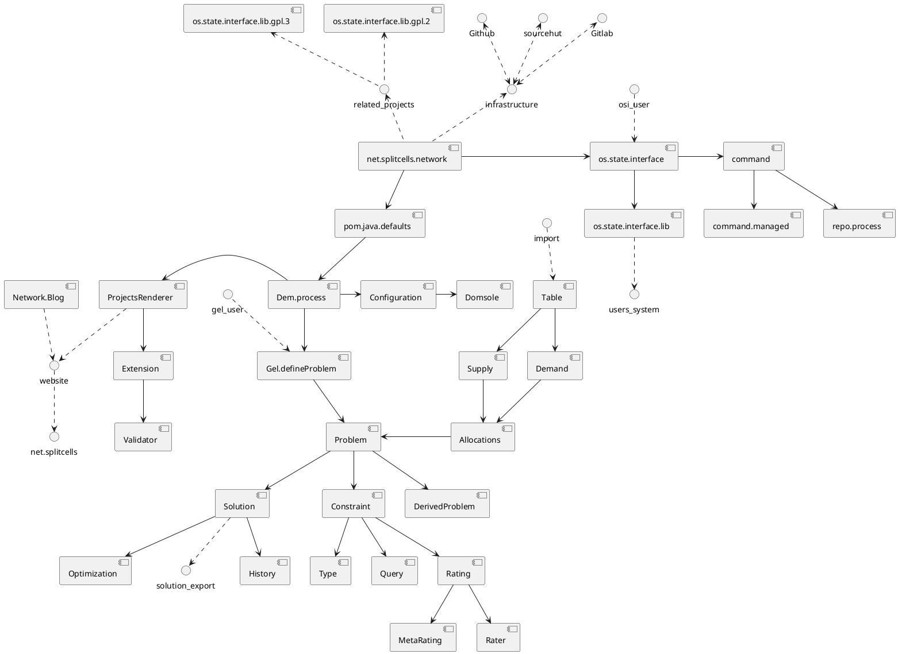
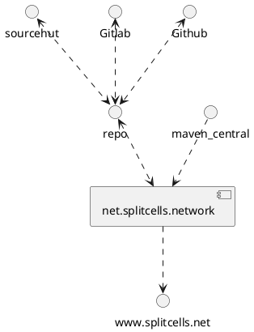

# Bird's-eye View of Splitcells Network

You can use browser extensions like [PlantUML Visualizer for Firefox](https://addons.mozilla.org/en-US/firefox/addon/plantuml-visualizer/)
to view the following diagram.

## Components

## Infrastructure

